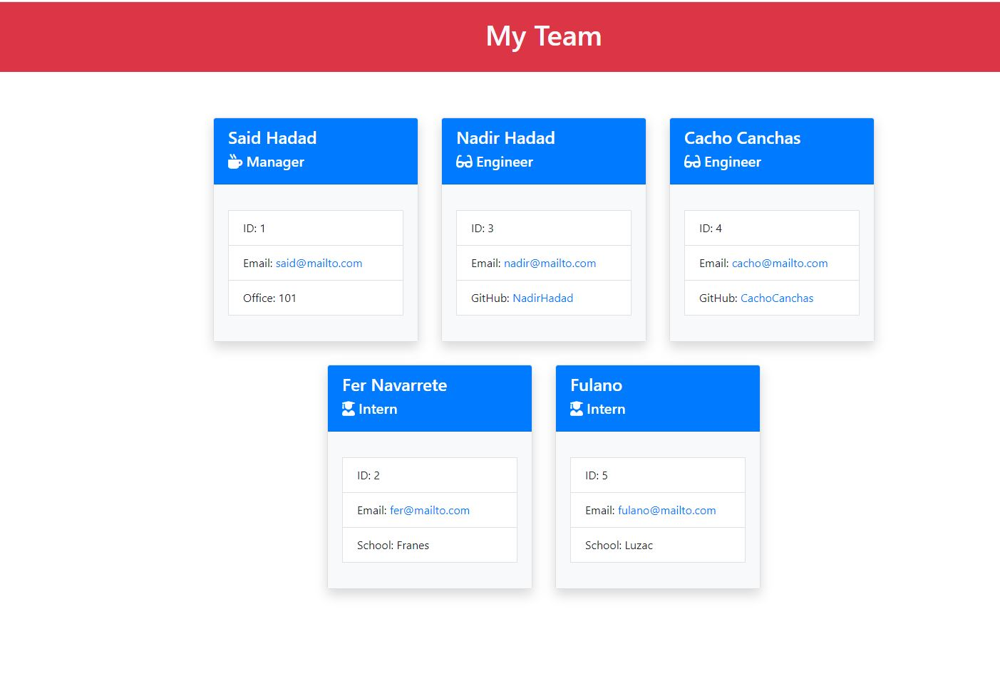

  <!-- PROJECT TITE -->
  <h1 align="center">Team Generator</h1>
  
  <!-- DESCRIPTION -->
  

  a Node.js command-line application that takes in information about employees on a software engineering team and generates an HTML webpage that displays summaries for each person.  
  Video Link: https://drive.google.com/file/d/1Qgp560LSrcFBCIJFJh09F2ooMsqp8zSu/view
  

  <!-- TABLE OF CONTENTS -->
  

  
Table of Contents

  <ol>
  <li><a href="#about-the-project">About The Project</a></li>
  <li><a href="#built-with">Built With</a></li>
  <li>
    <a href="#getting-started">Getting Started</a>
    <ul>
    <li><a href="#prerequisites">Prerequisites</a></li>
    <li><a href="#installation">Installation</a></li>
    </ul>
    </li>
  <li><a href="#contributing">Contributing</a></li>
  <li><a href="#license">License</a></li>
  <li><a href="#contact">Contact</a></li>
  </ol>
  

  
  
  <!-- ABOUT THE PROJECT -->
  ## About The Project

    
  10th Challenge for the University of Toronto Coding Bootcamp
  
  ## Built With

   JavaScript, E6S, Node, Bootstrap, OOP and TDD
  
  <!-- GETTING STARTED -->
  
  ## Getting Started

  ### Prerequisites

  Node, node_modules, Image, terminal, Jest for the test

  ### Installation

  On your terminal navigate to the Team Generator folder and run node index.js

  <!-- CONTRIBUTING -->
    
  <!-- LICENSE -->
  
  ## License

  MIT
  
  <!-- CONTACT -->
  
  ## Contact
  Name: Said David Hadad  
  Email: saiddavid.hadad@gmail.com  
  GIT: https://github.com/SaidHadad  